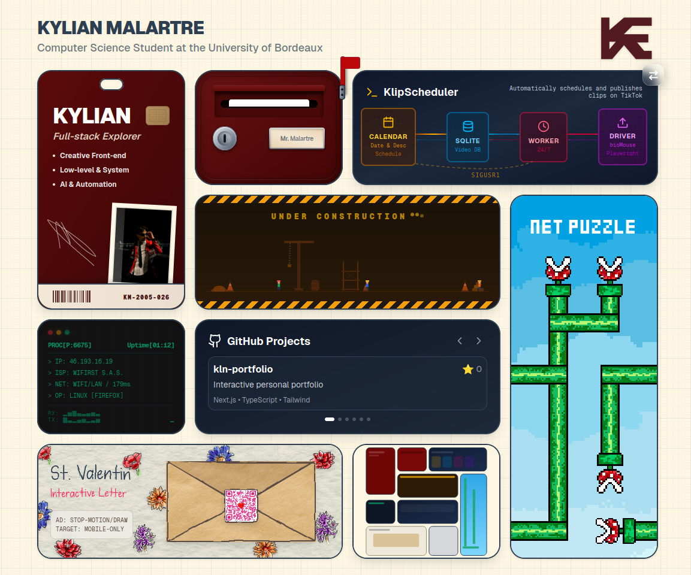

# Kylian Malartre

An interactive digital identity and project showcase built to explore and refine my programming skills. The project is live and hosted at [kylianmalartre.com](https://kylianmalartre.com).

This portfolio utilizes a **Bento Grid** architecture to organize disparate projects into a cohesive experience. It features real-time system monitoring, recursive visual components, and custom-filtered SVG aesthetics to create a unique, high-fidelity atmosphere.

## Screenshot

### Desktop Overview

## Features

- **Recursive "Inception" Engine:** A self-referencing card capturing the live viewport via an internal API (`/api/screenshot`). It implements a three-phase "dive" animation (Detach, Morph, Reset) using `requestAnimationFrame` to simulate a seamless entry into the recursive frame.
- **Concurrent System Probing:** Real-time environment analysis executing concurrent `Promise.all` tasks to fetch IP/ISP metadata and calculate network latency via `performance.now()` measurements.
- **Analog Narrative Engine (Valentine):** An integrated visual system combining `feDisplacementMap` SVG filters for "pencil-drawn" textures, `clip-path` polygons for 3D envelope physics, and a custom stop-motion `MiniSticker` component for randomized sprite-toggling.
- **UX & Performance Optimization:** Implementation of a `ZoomLock` component and viewport constraints to prevent accidental scaling on mobile devices. Uses hydration-safe logic to prevent SSR/CSR mismatches during system data fetching.
- **Technical SEO Integration:** Advanced metadata management using Next.js 15, featuring JSON-LD structured data injection for Google Person schemas and canonical URL synchronization.

## Tech Stack 

- **Framework:** Next.js 15 (App Router)
- **Language:** TypeScript
- **Styling:** Tailwind CSS
- **Icons:** Lucide React (System & Project iconography)
- **Optimization:** Next/Font (Local optimization for Pixel and Handwritten typography)

## Featured Projects

* **KlipScheduler**: Full automation of TikTok clip scheduling and publishing using Python and Playwright.
* **KlipMachine**: AI-powered pipeline (Whisper AI / FFmpeg) to transform long-form content into viral clips.
* **margaux-love-letter**: An interactive, mobile-optimized stop-motion narrative experience.
* **net-a22**: Low-level logic puzzle game built with C and the SDL library.